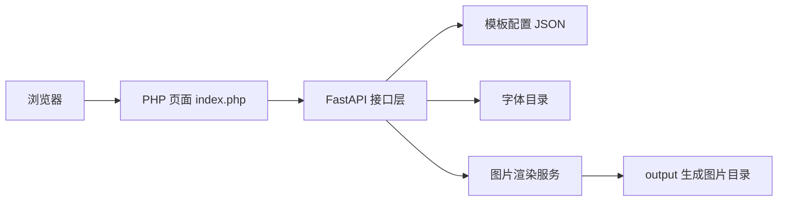
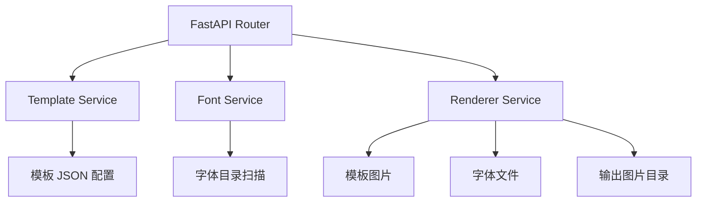
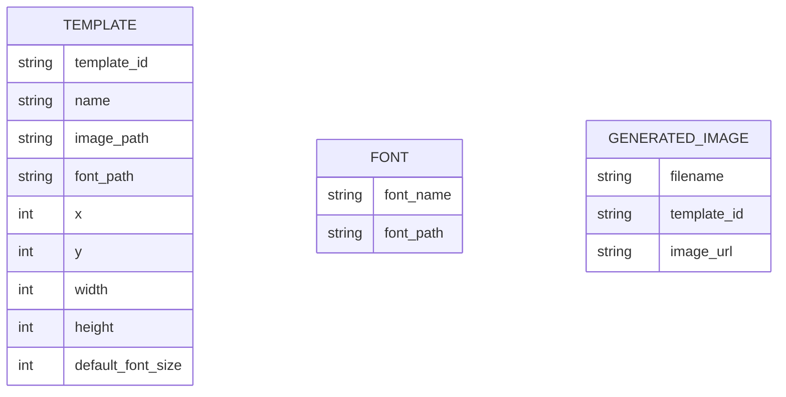

## 1. 架构设计



## 2. 技术说明
- 前端：PHP 8 + 原生 HTML/CSS/JavaScript
- 后端：FastAPI + Pillow
- 数据来源：`configs/templates/*.json`、`fonts/`、`templates/`
- 初始化方式：保留现有 Python 后端，新增 PHP 页面作为独立前端入口

## 3. 路由定义
| 路由 | 用途 |
|------|------|
| `/index.php` | 模板列表页和编辑入口 |
| `/api/fonts` | 返回当前字体目录中的可选字体列表 |
| `/templates` | 返回当前模板列表 |
| `/generate` | 生成图片并返回结果地址 |
| `/images/{filename}` | 访问生成后的图片 |

## 4. API 定义

### 4.1 字体列表接口
```ts
type FontItem = {
  font_name: string;
  font_path: string;
};

type FontsResponse = FontItem[];
```

### 4.2 模板列表接口
```ts
type TemplateItem = {
  template_id: string;
  name: string;
  image_path: string;
  font_path: string;
  image_exists: boolean;
  font_exists: boolean;
  text_box: {
    x: number;
    y: number;
    width: number;
    height: number;
  };
  default_font_size: number;
};
```

### 4.3 生成接口
```ts
type GenerateRequest = {
  template_id: string;
  text: string;
  font_path?: string;
};

type GenerateResponse = {
  template_id: string;
  image_url: string;
  filename: string;
};
```

## 5. 服务架构图



## 6. 数据模型

### 6.1 数据模型定义


### 6.2 数据定义说明
- 模板数据继续使用现有 `JSON` 配置文件，无需新增数据库。
- 字体数据通过扫描 `fonts/` 目录实时生成，保证下拉菜单与本地字体库一致。
- 生成结果文件继续输出到 `output/` 目录，通过静态路由访问。
- PHP 页面不直接处理图片生成逻辑，仅通过 HTTP 调用 Python 后端接口。
