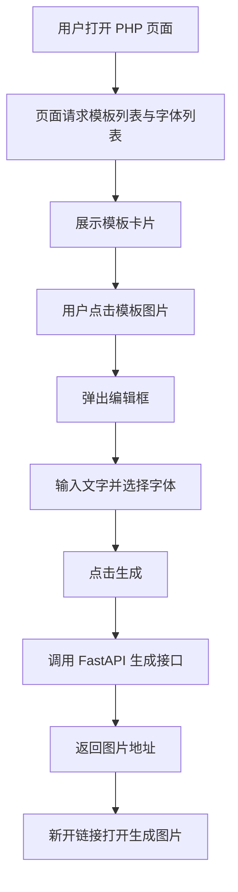

## 1. 产品概述
这是一个用于生成自定义表情包的 PHP 网页前端，用户可以浏览模板、输入文字、选择字体，并调用现有 FastAPI 后端生成图片。
- 目标用户是希望快速替换文案制作表情包的普通访客或运营人员。
- 产品价值是让模板选择、字体切换、生成跳转在一个网页内完成，降低制作门槛。

## 2. 核心功能

### 2.1 功能模块
1. **模板首页**：展示所有模板图片、模板名称、状态提示。
2. **编辑弹窗**：选择模板后弹出编辑框，支持文字输入和字体下拉选择。
3. **生成跳转**：提交后调用后端生成接口，并在新链接中打开结果图片。

### 2.2 页面明细
| 页面名称 | 模块名称 | 功能说明 |
|----------|----------|----------|
| 模板首页 | 顶部说明区 | 展示页面标题、使用说明、接口状态提示 |
| 模板首页 | 模板列表区 | 读取现有模板接口，展示模板缩略图、模板名称、按钮态 |
| 模板首页 | 编辑弹窗 | 显示选中的模板信息、文字输入框、字体选择下拉框、生成按钮 |
| 模板首页 | 结果反馈 | 在生成中显示加载状态，在失败时显示错误提示，在成功时新开链接 |

## 3. 核心流程
用户进入 PHP 页面后，前端先读取模板列表和字体列表；用户点击某个模板后弹出编辑框，输入文字并选择字体；点击生成后，前端调用后端生成接口，成功后在新窗口打开返回的图片地址。

## 4. 用户界面设计

### 4.1 设计风格
- 主色采用暖色米白与深色墨黑，突出“模板工作台”感。
- 按钮采用圆角卡片式风格，主按钮用高对比色强调生成动作。
- 标题字体保持有设计感，正文使用清晰易读的中文字体。
- 页面布局采用桌面优先的居中网格卡片布局。
- 图标和状态提示以简洁线性风格为主，不过度装饰。

### 4.2 页面设计概览
| 页面名称 | 模块名称 | UI 元素 |
|----------|----------|----------|
| 模板首页 | 顶部说明区 | 大标题、副标题、状态胶囊、轻微渐变背景 |
| 模板首页 | 模板列表区 | 模板卡片、预览图、模板标题、悬浮阴影、点击提示 |
| 模板首页 | 编辑弹窗 | 半透明遮罩、选中模板预览、文本框、字体下拉、操作按钮 |
| 模板首页 | 结果反馈 | 加载文案、错误气泡、成功后自动新开页面 |

### 4.3 响应式方案
- 采用桌面优先设计，优先适配 PC 浏览器。
- 窄屏时模板列表自动降为单列或双列。
- 弹窗在小屏设备上改为纵向布局，按钮撑满宽度。
